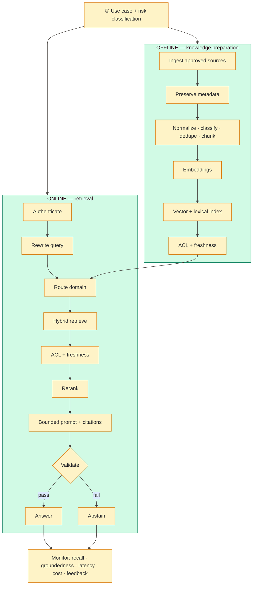

# scalable-enterprise-rag

[](./.github/workflows/ci.yml)

> **Scalable enterprise RAG architecture** — start with use-case and risk classification, then
> run two paths: **offline knowledge preparation** and **online retrieval**. Hybrid vector +
> keyword search, ACL and freshness filters, reranking, bounded prompts with citations, and
> **answer or abstain**. Ops monitors recall, relevance, groundedness, citation accuracy,
> latency, token cost, and user feedback.

Complements [`agentic-rag-engine`](https://github.com/mizbamd/agentic-rag-engine) (retrieval core)
and [`enterprise-ai-platform-planes`](https://github.com/mizbamd/enterprise-ai-platform-planes)
(knowledge plane contract). **This repo owns the end-to-end dual-path enterprise design.**

## High-level architecture

```
                         ┌──────────────────────────────────────┐
                         │     USE CASE + RISK CLASSIFICATION     │
                         └──────────────────┬───────────────────┘
              ┌─────────────────────────────┴─────────────────────────────┐
              ▼                                                           ▼
┌──────────────────────────────┐                     ┌──────────────────────────────────┐
│     OFFLINE  ·  PREPARE      │                     │       ONLINE  ·  SERVE             │
│  Ingest approved sources     │                     │  Authenticate caller               │
│  Preserve metadata           │                     │  Classify / rewrite query         │
│  Normalize·classify·dedupe   │                     │  Route to domain index             │
│  Chunk → embeddings          │ ════ domain ══════► │  Hybrid: vector + keyword          │
│  Index vectors + lexical     │      indexes        │  ACL + freshness filters           │
│  ACL + freshness metadata    │                     │  Rerank → cited prompt             │
│                              │                     │  Generate · validate · answer/abstain│
└──────────────────────────────┘                     └──────────────────┬───────────────┘
                                                                        ▼
                                                     ┌──────────────────────────────────┐
                                                     │ MONITOR: recall · relevance ·      │
                                                     │ groundedness · citations · latency │
                                                     │ token cost · user feedback         │
                                                     └──────────────────────────────────┘
```



## Run

```bash
python -m venv .venv && source .venv/bin/activate
pip install pytest
pytest -q
./scripts/demo.sh
```

### API (optional)
```bash
pip install fastapi uvicorn pydantic
PYTHONPATH=src uvicorn enterprise_rag.api:app --port 8091
# POST /v1/ask  {"query": "..."}
# GET  /v1/metrics
# GET  /v1/architecture
```

## Documentation
- [`docs/SYSTEM-DESIGN.md`](docs/SYSTEM-DESIGN.md) — full HLD + SLOs
- ADRs: [`docs/adr/`](docs/adr/)

## Toolbox
`Python` · `Hybrid RAG` · `ACL` · `Freshness` · `Domain routing` · `Abstain/guardrails` · `Ops metrics` · `FastAPI`
