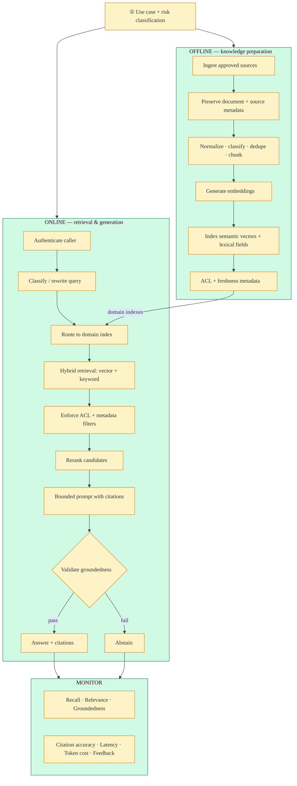

# System Design: Scalable Enterprise RAG

## 1. Design gate
Begin with **use case and risk classification** (low / medium / high). Risk drives
groundedness thresholds, citation requirements, and abstain policy before any retrieval work.

## 2. High-level architecture (two paths)

```
                         ┌──────────────────────────────────────┐
                         │     USE CASE + RISK CLASSIFICATION     │
                         │   faq · assistant · regulated / HILO   │
                         └──────────────────┬───────────────────┘
                                            │
              ┌─────────────────────────────┴─────────────────────────────┐
              │                                                           │
              ▼                                                           ▼
┌──────────────────────────────┐                     ┌──────────────────────────────────┐
│     OFFLINE  ·  PREPARE      │                     │       ONLINE  ·  SERVE             │
│                              │                     │                                    │
│  1 Ingest approved sources   │                     │  1 Authenticate caller             │
│  2 Preserve doc + source meta│                     │  2 Classify / rewrite query       │
│  3 Normalize · classify      │                     │  3 Route to domain index           │
│     dedupe · chunk           │                     │  4 Hybrid retrieve (vector+keyword)│
│  4 Generate embeddings       │ ════════ index ═══► │  5 Enforce ACL + freshness filters │
│  5 Index vectors + lexical   │                     │  6 Rerank candidates               │
│  6 Apply ACL + freshness     │                     │  7 Bounded prompt + citations      │
│                              │                     │  8 Generate · validate · answer/   │
│                              │                     │     abstain                        │
└──────────────────────────────┘                     └──────────────────┬───────────────┘
                                                                        │
                                                                        ▼
                                                     ┌──────────────────────────────────┐
                                                     │  MONITOR                         │
                                                     │  recall · relevance · groundedness│
                                                     │  citation accuracy · latency      │
                                                     │  token cost · user feedback        │
                                                     └──────────────────────────────────┘
```

## 3. Mermaid (presentation / README)



## 4. SLOs

| Metric | Target |
|---|---|
| Online hybrid retrieve p99 | < 300 ms (local index demo) |
| Groundedness (answered) | ≥ use-case threshold |
| Citation present when answered | 100% |
| High-risk abstain when weak evidence | Required |
| Token cost | Metered per request |

## 5. Relationship to portfolio

| Concern | This repo | Sibling |
|---|---|---|
| Dual-path enterprise RAG HLD | **Primary** | — |
| Retrieval/eval core patterns | Implements | Complements `agentic-rag-engine` |
| Knowledge plane in five-plane AI | Implements | `enterprise-ai-platform-planes` |
| Governed tools / HITL | Out of scope here | `governed-mcp-gateway` |
